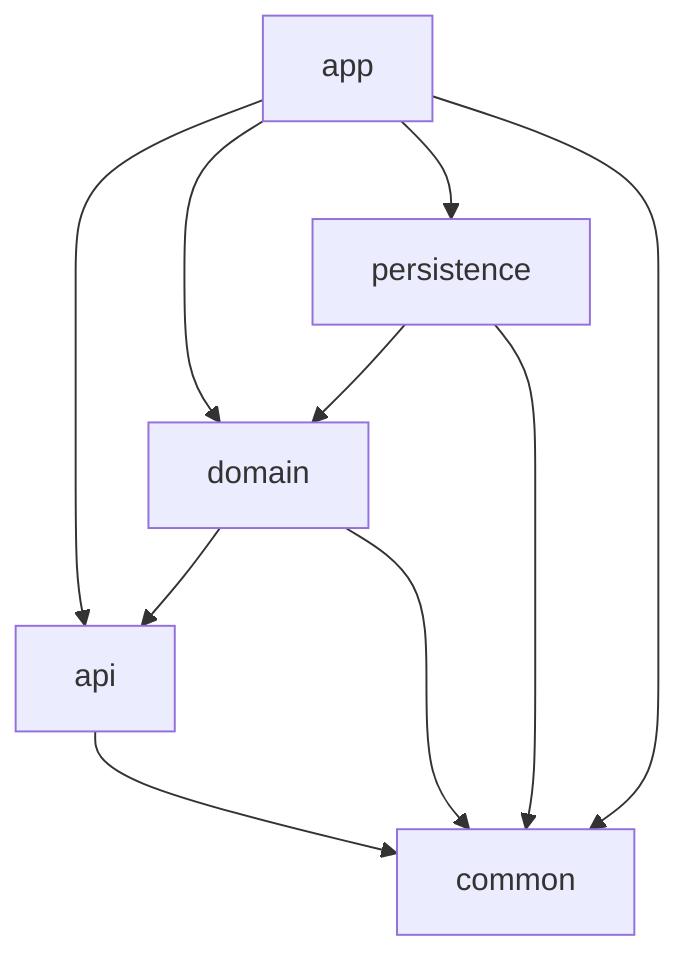

# Contributing to Kotlin Spring Boot Enterprise Template

Thank you for your interest in contributing to this project! This guide will help you understand our development
process, coding standards, and how to submit contributions effectively.

## 📋 Table of Contents

- [Getting Started](#-getting-started)
- [Development Environment](#-development-environment)
- [Project Structure](#-project-structure)
- [Code Standards](#-code-standards)
- [Testing Guidelines](#-testing-guidelines)
- [Security Considerations](#-security-considerations)
- [Contribution Workflow](#-contribution-workflow)
- [Pull Request Process](#-pull-request-process)
- [Issue Reporting](#-issue-reporting)
- [Documentation](#-documentation)
- [Community Guidelines](#-community-guidelines)

## 🚀 Getting Started

### Prerequisites

Before contributing, ensure you have:

- **JDK 24+** (Bellsoft Liberica recommended)
- **Docker** (for container builds and testing)
- **Git** with proper configuration
- **IDE** with Kotlin support (IntelliJ IDEA recommended)

### Initial Setup

1. **Fork the repository**
   ```bash
   # Fork on GitHub, then clone your fork
   git clone https://github.com/YOUR_USERNAME/kotlin-spring-boot-gradle-starter.git
   cd kotlin-spring-boot-gradle-starter
   ```

2. **Add upstream remote**
   ```bash
   git remote add upstream https://github.com/denissajnar/kotlin-spring-boot-gradle-starter.git
   ```

3. **Verify your environment**
   ```bash
   java -version  # Should show JDK 24+
   docker --version
   ./gradlew --version
   ```

4. **Build the project**
   ```bash
   ./gradlew build
   ```

## 💻 Development Environment

### Recommended IDE Configuration

**IntelliJ IDEA Settings:**

- **Code Style**: Import `.editorconfig` settings
- **Kotlin**: Use bundled Kotlin plugin
- **Gradle**: Use Gradle wrapper, auto-import enabled
- **Inspections**: Enable Kotlin and Spring Boot inspections

### Branch Strategy

We follow a Git flow-inspired branching model:

- `master` - Production-ready code
- `develop` - Integration branch for features
- `feature/*` - Feature development branches
- `hotfix/*` - Critical fixes for production
- `release/*` - Release preparation branches

### Environment Variables

For local development, you may need:

```bash
# Optional: Faster OWASP dependency scans
export NVD_API_KEY="your-nvd-api-key"

# Optional: Custom registry for container builds
export DOCKER_REGISTRY="registry.example.com"
```

## 🏗 Project Structure

This is a multi-module Gradle project with clean architecture:

```
.
├── build-logic/            # Convention plugins for build logic
│   └── src/main/kotlin/    # Reusable Gradle conventions
├── api/                    # API interfaces and DTOs
├── app/                    # Spring Boot application (main module)
├── common/                 # Shared utilities and constants  
├── domain/                 # Business logic and domain models
├── persistence/            # Data access layer
└── gradle/                 # Gradle configuration and wrapper
```

### Module Dependencies



### Key Design Principles

- **Clean Architecture**: Clear separation of concerns
- **Dependency Inversion**: High-level modules don't depend on low-level modules
- **Single Responsibility**: Each module has a focused purpose
- **Convention over Configuration**: Standardized build logic via convention plugins

## 📝 Code Standards

### Kotlin Style Guide

We follow the [Kotlin Coding Conventions](https://kotlinlang.org/docs/coding-conventions.html) with these additions:

**Formatting Rules:**

- **Indentation**: 4 spaces (no tabs)
- **Line Length**: 120 characters maximum
- **Imports**: Organized and optimized automatically
- **Trailing Commas**: Required in multi-line constructs

**Naming Conventions:**

- **Classes**: PascalCase (`UserService`)
- **Functions**: camelCase (`getUserById`)
- **Properties**: camelCase (`isActive`)
- **Constants**: UPPER_SNAKE_CASE (`MAX_RETRY_COUNT`)
- **Packages**: lowercase with dots (`com.template.domain`)

### Code Formatting

**Automatic Formatting:**

```bash
# Apply all formatting
./gradlew spotlessApply

# Apply only Kotlin formatting
./gradlew ktlintFormat

# Check formatting (CI will run this)
./gradlew spotlessCheck ktlintCheck
```

**Pre-commit Hook (Recommended):**

```bash
# Create .git/hooks/pre-commit
#!/bin/sh
./gradlew spotlessCheck ktlintCheck
```

### Code Quality Tools

We use multiple tools to ensure code quality:

- **KtLint**: Kotlin style and formatting
- **Spotless**: Multi-language code formatting
- **Kover**: Code coverage measurement
- **Dokka**: API documentation generation
- **OWASP**: Dependency vulnerability scanning
- **SonarCloud**: Continuous code quality inspection

## 🧪 Testing Guidelines

### Testing Strategy

We follow the testing pyramid approach:

1. **Unit Tests** (70%): Fast, isolated tests for individual components
2. **Integration Tests** (20%): Test module interactions
3. **End-to-End Tests** (10%): Full application workflow tests

### Testing Standards

**Test Structure:**

```kotlin
@Test
fun `should return user when valid id provided`() {
    // Given
    val userId = "123"
    val expectedUser = User(id = userId, name = "John")

    // When
    val result = userService.findById(userId)

    // Then
    assertThat(result).isEqualTo(expectedUser)
}
```

**Test Categories:**

- Use `@Tag("unit")` for unit tests
- Use `@Tag("integration")` for integration tests
- Use `@TestMethodOrder(OrderAnnotation::class)` when order matters

**Running Tests:**

```bash
# All tests
./gradlew test

# Specific module
./gradlew :domain:test

# With coverage
./gradlew test koverHtmlReport

# Integration tests only
./gradlew test --tests "*IntegrationTest"
```

### Coverage Requirements

- **Minimum Coverage**: 80% line coverage
- **Critical Paths**: 95% coverage required
- **New Code**: Must not decrease overall coverage

**Coverage Commands:**

```bash
# Generate coverage report
./gradlew koverHtmlReport

# Verify coverage thresholds
./gradlew koverVerify

# View report
open build/reports/kover/html/index.html
```

## 🔒 Security Considerations

### Security Scanning

Our CI/CD pipeline includes comprehensive security scanning:

**Dependency Scanning:**

```bash
# Check for vulnerable dependencies
./gradlew dependencyCheckAnalyze

# Check for outdated dependencies  
./gradlew dependencyUpdates
```

**Container Scanning:**

- **Trivy**: Vulnerability scanning for containers
- **Grype**: Additional container security analysis
- **CodeQL**: Static analysis for security issues

### Security Best Practices

**Code Security:**

- Never commit secrets or API keys
- Use environment variables for sensitive configuration
- Validate all inputs and sanitize outputs
- Follow OWASP security guidelines

**Dependency Management:**

- Keep dependencies up to date
- Review security advisories for used libraries
- Use dependency lock files when possible
- Prefer well-maintained, popular libraries

## 🔄 Contribution Workflow

### 1. Planning Your Contribution

**For New Features:**

- Open an issue first to discuss the feature
- Wait for maintainer approval before starting work
- Consider breaking large features into smaller PRs

**For Bug Fixes:**

- Search existing issues first
- Include reproduction steps in your issue
- Link to the issue in your PR

### 2. Development Process

```bash
# 1. Create feature branch from develop
git checkout develop
git pull upstream develop
git checkout -b feature/your-feature-name

# 2. Make your changes
# ... code, test, commit ...

# 3. Keep your branch updated
git fetch upstream
git rebase upstream/develop

# 4. Run quality checks
./gradlew spotlessCheck ktlintCheck test koverVerify

# 5. Push your branch
git push origin feature/your-feature-name

# 6. Open a Pull Request
```

### 3. Commit Standards

**Commit Message Format:**

```
type(scope): short description

Longer description explaining what changed and why.

Fixes #123
```

**Types:**

- `feat`: New feature
- `fix`: Bug fix
- `docs`: Documentation changes
- `style`: Code style changes (formatting, etc.)
- `refactor`: Code restructuring without functionality changes
- `test`: Adding or updating tests
- `chore`: Build process or auxiliary tool changes

**Examples:**

```
feat(api): add user authentication endpoint

Add JWT-based authentication with refresh tokens.
Includes rate limiting and security headers.

Fixes #45

fix(persistence): resolve database connection leak

Connection pool was not properly closing connections
in error scenarios, causing resource exhaustion.

Fixes #67
```

## 🔍 Pull Request Process

### PR Requirements

**Before Submitting:**

- [ ] Code follows project style guidelines
- [ ] Tests pass locally (`./gradlew test`)
- [ ] Code coverage maintained (`./gradlew koverVerify`)
- [ ] Documentation updated (if needed)
- [ ] Security scan passes (`./gradlew dependencyCheckAnalyze`)
- [ ] No merge conflicts with target branch

**PR Description Template:**

```markdown
## Description

Brief description of changes and motivation.

## Type of Change

- [ ] Bug fix (non-breaking change)
- [ ] New feature (non-breaking change)
- [ ] Breaking change (fix or feature causing existing functionality to change)
- [ ] Documentation update

## Testing

- [ ] Unit tests added/updated
- [ ] Integration tests added/updated
- [ ] Manual testing completed

## Checklist

- [ ] Code follows style guidelines
- [ ] Self-review completed
- [ ] Tests pass
- [ ] Documentation updated

Fixes #(issue_number)
```

### Review Process

**Automated Checks:**

- Build and test execution
- Code formatting validation
- Security vulnerability scanning
- Test coverage verification
- Documentation generation

**Manual Review:**

- Code quality and maintainability
- Architecture and design decisions
- Test coverage and quality
- Documentation completeness
- Security considerations

**Review Timeline:**

- Small PRs (< 100 lines): 1-2 business days
- Medium PRs (100-500 lines): 2-3 business days
- Large PRs (> 500 lines): 3-5 business days

## 🐛 Issue Reporting

### Bug Reports

**Use this template:**

```markdown
**Describe the bug**
A clear description of what the bug is.

**To Reproduce**
Steps to reproduce:

1. Go to '...'
2. Click on '...'
3. See error

**Expected behavior**
What you expected to happen.

**Screenshots**
Add screenshots if applicable.

**Environment:**

- OS: [e.g. macOS, Ubuntu]
- Java version: [e.g. 24]
- Gradle version: [e.g. 9.0]
- Spring Boot version: [e.g. 4.0.0]

**Additional context**
Any other relevant information.
```

### Feature Requests

**Use this template:**

```markdown
**Is your feature request related to a problem?**
A clear description of the problem.

**Describe the solution you'd like**
Clear description of what you want to happen.

**Describe alternatives you've considered**
Alternative solutions or features you've considered.

**Additional context**
Any other context, mockups, or examples.
```

### Issue Labels

- `bug`: Something isn't working
- `enhancement`: New feature or request
- `documentation`: Improvements to docs
- `good first issue`: Good for newcomers
- `help wanted`: Extra attention needed
- `priority/high`: High priority
- `priority/medium`: Medium priority
- `priority/low`: Low priority

## 📚 Documentation

### Code Documentation

**Kotlin Documentation (KDoc):**

```kotlin
/**
 * Service for managing user accounts and authentication.
 *
 * This service handles user lifecycle operations including creation,
 * authentication, and profile management.
 *
 * @since 1.0.0
 * @author Your Name
 */
class UserService {

    /**
     * Authenticates a user with email and password.
     *
     * @param email User's email address
     * @param password Plain text password
     * @return Authentication token if successful
     * @throws AuthenticationException if credentials are invalid
     */
    fun authenticate(email: String, password: String): AuthToken {
        // Implementation
    }
}
```

**API Documentation:**

- Use OpenAPI/Swagger annotations
- Document all endpoints, parameters, and responses
- Include example requests and responses
- Update documentation with code changes

**README Updates:**

- Update version compatibility information
- Add new feature documentation
- Update setup instructions if needed
- Keep examples current

### Generating Documentation

```bash
# Generate API documentation
./gradlew dokkaHtmlMultiModule

# View documentation
open build/dokka/index.html

# Generate specific module docs
./gradlew :api:dokkaHtml
```

## 🤝 Community Guidelines

### Code of Conduct

We are committed to providing a welcoming and inclusive environment:

- **Be Respectful**: Treat everyone with respect
- **Be Inclusive**: Welcome newcomers and diverse perspectives
- **Be Collaborative**: Help others learn and grow
- **Be Professional**: Keep discussions focused and constructive

### Communication Channels

- **Issues**: Bug reports and feature requests
- **Pull Requests**: Code contributions and reviews
- **Discussions**: General questions and ideas
- **Security**: Use GitHub security advisories for security issues

### Recognition

Contributors are recognized through:

- Contributor acknowledgments in releases
- GitHub contributor statistics
- Special recognition for significant contributions
- Invitation to become maintainers for consistent contributors

## 🎯 Getting Help

### Common Issues

**Build Failures:**

```bash
# Clean and rebuild
./gradlew clean build

# Update dependencies
./gradlew build --refresh-dependencies

# Check Java version
java -version
```

**Formatting Issues:**

```bash
# Auto-fix formatting
./gradlew spotlessApply ktlintFormat

# Check what needs formatting
./gradlew spotlessCheck ktlintCheck
```

**Test Failures:**

```bash
# Run tests with debug info
./gradlew test --info --stacktrace

# Run specific test
./gradlew test --tests "com.template.UserServiceTest"
```

### Support Channels

1. **GitHub Issues**: Technical problems and bugs
2. **GitHub Discussions**: Questions and general help
3. **Documentation**: Check README and this guide first
4. **Code Examples**: Look at existing code for patterns

---

Thank you for contributing to the Kotlin Spring Boot Enterprise Template! Your contributions help make this project
better for everyone. 🚀