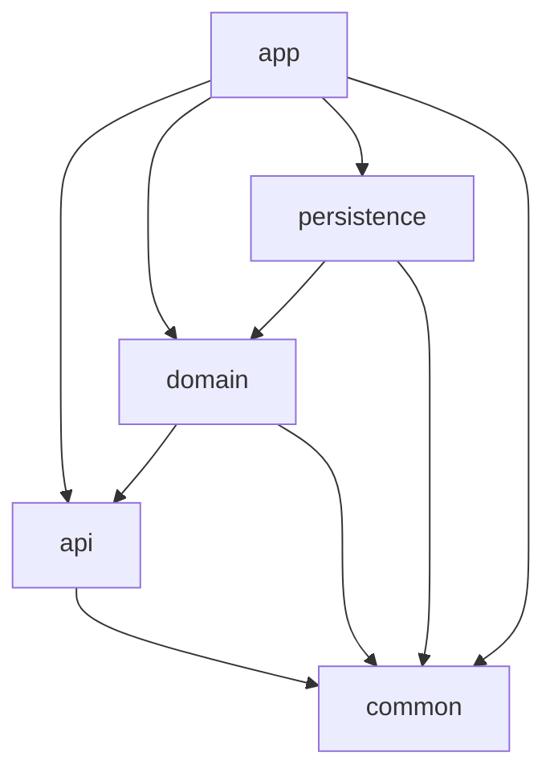

# Kotlin Spring Boot Enterprise Template

[](https://github.com/denissajnar/kotlin-spring-boot-gradle-starter/actions)
[](http://kotlinlang.org)
[](https://spring.io/projects/spring-boot)
[](https://openjdk.org/)
[](https://gradle.org/)
[](LICENSE)
[](https://codecov.io/)

Production-ready, enterprise-grade multi-module project template for Kotlin Spring Boot applications with comprehensive
quality gates, security scanning, and cloud-native deployment support.

## 📋 Table of Contents

- [Features](#-features)
- [Technology Stack](#-technology-stack)
- [Prerequisites](#-prerequisites)
- [Quick Start](#-quick-start)
- [Project Structure](#-project-structure)
- [Development](#-development)
- [Testing](#-testing)
- [Code Quality](#-code-quality)
- [Container Support](#-container-support)
- [CI/CD](#-cicd)
- [Documentation](#-documentation)
- [Contributing](#-contributing)
- [License](#-license)

## ✨ Features

- **🏗️ Multi-Module Architecture** - Clean separation of concerns with Gradle composite builds
- **🔧 Convention Plugins** - Reusable build logic for consistent configuration
- **✅ Quality Gates** - Automated code quality checks with KtLint, Spotless, and Kover
- **🔒 Security Scanning** - OWASP dependency vulnerability detection
- **📦 Cloud Native** - Paketo buildpacks with JVM and GraalVM native image support
- **📊 Observability** - Metrics, tracing, and health checks with Micrometer
- **🚀 Performance** - Optimized for fast startup and low memory footprint
- **📖 Documentation** - Automated API documentation with Dokka
- **🔄 Dependency Management** - Automated dependency updates tracking

## 🛠 Technology Stack

| Technology        | Version        | Description                  |
|-------------------|----------------|------------------------------|
| Kotlin            | 2.2.0+         | Primary programming language |
| Spring Boot       | 4.0.0-SNAPSHOT | Application framework        |
| Java              | 24+            | Runtime environment          |
| Gradle            | 9.0+           | Build automation             |
| Paketo Buildpacks | Latest         | Container image building     |
| GraalVM           | Latest         | Native image compilation     |

## 📋 Prerequisites

Before you begin, ensure you have the following installed:

- **JDK 24** or higher (Bellsoft Liberica recommended)
  ```bash
  java -version
  ```

- **Docker** (for container builds)
  ```bash
  docker --version
  ```

- **Gradle 9.0+** (or use the wrapper)
  ```bash
  ./gradlew --version
  ```

## 🚀 Quick Start

### 1. Clone the repository

```bash
git clone https://github.com/denissajnar/kotlin-spring-boot-gradle-starter.git
cd kotlin-spring-boot-gradle-starter
```

### 2. Build the project

```bash
./gradlew build
```

### 3. Run the application

```bash
./gradlew :app:bootRun
```

The application will be available at:

- Application: http://localhost:8080
- Health: http://localhost:8081/actuator/health
- Metrics: http://localhost:8081/actuator/metrics

### 4. Build container image

```bash
# JVM-based image
./gradlew :app:bootBuildImage

# Native image
./gradlew :app:bootBuildImage -Pnative
```

## 📁 Project Structure

```
.
├── build-logic/            # Convention plugins (composite build)
│   └── src/main/kotlin/    # Build conventions
├── api/                    # API interfaces and DTOs
├── app/                    # Spring Boot application
├── common/                 # Shared utilities and constants
├── domain/                 # Business logic and domain models
├── persistence/            # Data access layer
└── gradle/                 # Gradle wrapper and configuration
```

### Module Dependencies



## 💻 Development

### Running locally

```bash
# Run the application
./gradlew :app:bootRun

# With specific profile
./gradlew :app:bootRun --args='--spring.profiles.active=local'
```

### Code formatting

```bash
# Check formatting
./gradlew spotlessCheck

# Apply formatting
./gradlew spotlessApply

# KtLint format
./gradlew ktlintFormat
```

## 🧪 Testing

### Unit tests

```bash
./gradlew test
```

### Test coverage

```bash
# Run tests with coverage
./gradlew koverVerify

# Generate HTML report
./gradlew koverHtmlReport
# Open: build/reports/kover/html/index.html
```

## ✅ Code Quality

### Quality checks

Run individual quality checks:

```bash
# Code style checks
./gradlew ktlintCheck

# Formatting validation
./gradlew spotlessCheck

# Test coverage verification
./gradlew koverVerify

# Unit tests
./gradlew test
```

### Security scanning

```bash
# Check for vulnerable dependencies
./gradlew dependencyCheckAnalyze

# Check for outdated dependencies
./gradlew showOutdatedDependencies
```

### Generate quality reports

```bash
./gradlew generateQualityReports
```

Reports will be available in:

- Coverage: `build/reports/kover/html/index.html`
- Dependencies: `build/reports/dependency-updates/dependency-updates-report.html`
- Security: `build/reports/dependency-check/dependency-check-report.html`

## 🐳 Container Support

### Building images

```bash
# JVM-based container (optimized with Paketo buildpacks)
./gradlew :app:bootBuildImage

# Native container (GraalVM)
./gradlew :app:bootBuildImage -Pnative

# Custom registry
./gradlew :app:bootBuildImage \
  --imageName=registry.example.com/myapp:latest
```

### Running containers

```bash
# Run JVM container
docker run -p 8080:8080 com.template/app:0.0.1-SNAPSHOT

# Run with environment variables
docker run -p 8080:8080 \
  -e SPRING_PROFILES_ACTIVE=prod \
  -e SERVER_PORT=8080 \
  com.template/app:0.0.1-SNAPSHOT
```

## 🔄 CI/CD

### GitHub Actions

The project includes GitHub Actions workflows for:

- Continuous Integration (CI)
- Security scanning
- Container image building
- Automated dependency updates

See [.github/workflows/ci.yml](.github/workflows/ci.yml) for details.

### Environment variables

Required for CI/CD:

| Variable          | Description                    | Required                |
|-------------------|--------------------------------|-------------------------|
| `NVD_API_KEY`     | OWASP dependency check API key | Optional (faster scans) |
| `DOCKER_USERNAME` | Docker registry username       | For publishing          |
| `DOCKER_PASSWORD` | Docker registry password       | For publishing          |
| `DOCKER_REGISTRY` | Custom registry URL            | Optional                |

## 📖 Documentation

### API Documentation

Generate API documentation:

```bash
# Multi-module documentation
./gradlew dokkaHtmlMultiModule

# Module-specific
./gradlew :api:dokkaHtml
```

View documentation:

- Open `build/dokka/index.html`

## 🤝 Contributing

We welcome contributions! Please see our [Contributing Guide](CONTRIBUTING.md) for details.

### Development setup

1. Fork the repository
2. Create a feature branch
   ```bash
   git checkout -b feature/amazing-feature
   ```
3. Make your changes
4. Run quality checks
   ```bash
   ./gradlew ktlintCheck spotlessCheck koverVerify test
   ```
5. Commit your changes
   ```bash
   git commit -m 'Add amazing feature'
   ```
6. Push to your fork
   ```bash
   git push origin feature/amazing-feature
   ```
7. Open a Pull Request

### Code style

This project uses:

- [KtLint](https://pinterest.github.io/ktlint/) for Kotlin linting
- [Spotless](https://github.com/diffplug/spotless) for code formatting
- 4 spaces for indentation
- 120 character line limit

## 📊 Metrics

### Build performance

| Task                     | Duration |
|--------------------------|----------|
| Clean build              | ~45s     |
| Incremental build        | ~8s      |
| Test execution           | ~12s     |
| Container build (JVM)    | ~60s     |
| Container build (Native) | ~5m      |

### Application metrics

| Metric       | JVM    | Native |
|--------------|--------|--------|
| Startup time | ~2.5s  | ~0.08s |
| Memory usage | ~256MB | ~64MB  |
| Image size   | ~180MB | ~85MB  |

## 🔗 Resources

- [Kotlin Documentation](https://kotlinlang.org/docs)
- [Spring Boot Reference](https://docs.spring.io/spring-boot/docs/current/reference/)
- [Gradle User Manual](https://docs.gradle.org/current/userguide/)
- [Paketo Buildpacks](https://paketo.io/)
- [GraalVM Native Image](https://www.graalvm.org/native-image/)

## 📄 License

This project is licensed under the MIT License - see the [LICENSE](LICENSE) file for details.

## 🙏 Acknowledgments

- Spring Boot team for the excellent framework
- JetBrains for Kotlin and IntelliJ IDEA
- Gradle team for the build tool
- Paketo buildpacks community
- All contributors and maintainers

---

<div align="center">
  <sub>Built with ❤️ using Kotlin and Spring Boot</sub>
</div>